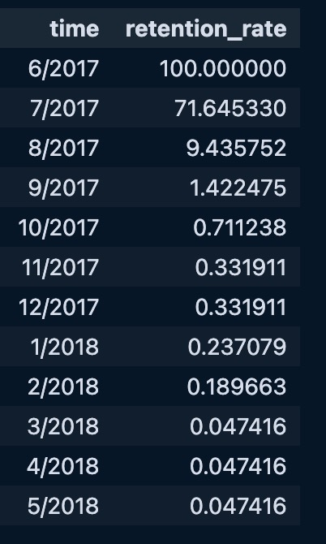
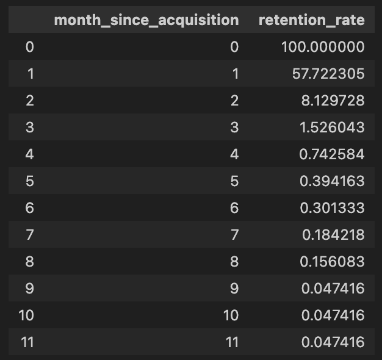

### 1
The assumption that Netflix has a contractual relationship with its customers is reasonable because Netflix operates on a subscription-based model, where users commit to recurring payments for continued access to the platform. In the SVOD industry, services like Netflix typically require users to create an account and agree to monthly or annual billing, which aligns with the definition of a contractual relationship. Although users can cancel their subscription at any time, the ongoing nature of the payment agreement and access to content makes this a contractual relationship. This setup facilitates a more predictable estimation of Customer Lifetime Value (CLV) compared to non-contractual models.

### 2a
(6, 2017) until (5, 2018), Unique users: 20850

### 3a

### 3b

### 3c
Average retention rate of cohort 0: 15.37%

### 3d
Industry Benchmarks
Netflix and other major Subscription Video On Demand (SVOD) platforms typically report much higher retention rates. Industry data suggests:
1.  Monthly Retention Rates: SVOD platforms like Netflix often have monthly retention rates exceeding 90%.
2. Monthly Churn Rates: Reported churn rates are generally low, often around 2% to 5% per month, implying retention rates of 95% to 98%.

Comparing our calculated retention rates with industry benchmarks:

Our Retention Rates:

- Sharp decline from 100% to 71.65% in the first month.
- Further drop to 9.44% in the second month.
- Retention rates fall below 1% after a few months.

Industry Benchmarks:

- Retention rates remain above 90% month over month.
- Churn rates are low, indicating that most users continue their subscriptions.

Several reasons may cause this discrepancy between our results and industry benchmarks:

1. Data Limitations

    i. Inability to Track All User Activity:

    The data only captures user activity on desktop and laptops.
    Users who switch to other devices (e.g., mobile phones, tablets, smart TVs) are not tracked and are considered as churned in our dataset.

    ii. Subscription Variable:

    The subscription variable is always 1 in the dataset, as we cannot observe if a user cancels their subscription.
    We define churn as users who stop watching Netflix on desktop or laptop, which may not reflect actual cancellations.

2. Overestimation of Churn

    i. Device Switching:

    Users may simply change devices rather than cancel their subscriptions.
    Given the popularity of mobile and smart TV usage for streaming, many users may migrate away from desktops.

    ii. Misclassification of Active Users:

    Users who are inactive on desktop/laptop but active on other devices are misclassified as churned.

3. Data Collection Period and Sample

    i. Sample Representation:

    The dataset may not be representative of the entire Netflix user base.
    It may focus on a specific segment with different usage patterns.

    ii. Time Frame:

    The data covers a specific 12-month period, which may not capture long-term retention behaviors.

4. User Behavior Patterns

    i. Desktop Usage Decline:

    There has been a general trend towards increased mobile and connected TV usage for streaming. Desktop streaming may show higher churn due to this shift.

    ii. Content Consumption Habits:

    Users might use desktops for initial sign-ups or trials and then switch to other devices.

### 3e.

Monthly Retention Rate by Cohort:

| Month | Cohort 1 | Cohort 2 | Cohort 3 | Cohort 4 | Cohort 5 | Cohort 6 | Cohort 7 | Cohort 8 | Cohort 9 | Cohort 10 | Cohort 11 |
|-------|----------|----------|----------|----------|----------|----------|----------|----------|----------|-----------|-----------|
| 0     | 100.00   | 100.00   | 100.00   | 100.00   | 100.00   | 100.00   | 100.00   | 100.00   | 100.00   | 100.00    | 100.00    |
| 1     | 54.56    | 52.52    | 44.56    | 44.00    | 64.92    | 73.29    | 58.44    | 70.28    | 46.26    | 54.48     | -         |
| 2     | 17.28    | 4.13     | 5.55     | 17.06    | 3.80     | 8.49     | 4.60     | 7.53     | 3.42     | -         | -         |
| 3     | 2.32     | 1.13     | 2.00     | 1.09     | 1.34     | 1.22     | 1.99     | 1.21     | -        | -         | -         |
| 4     | 0.88     | 0.40     | 1.33     | 0.52     | 0.50     | 0.58     | 1.02     | -        | -        | -         | -         |
| 5     | 0.56     | 0.23     | 0.59     | 0.34     | 0.45     | 0.26     | -        | -        | -        | -         | -         |
| 6     | 0.24     | 0.17     | 0.44     | 0.29     | 0.34     | -        | -        | -        | -        | -         | -         |
| 7     | 0.16     | 0.11     | 0.30     | 0.11     | -        | -        | -        | -        | -        | -         | -         |
| 8     | -        | 0.06     | 0.22     | -        | -        | -        | -        | -        | -        | -         | -         |

Average Retention Rates:

| Cohort | Average Retention Rate |
|--------|-------------------------|
| 1      | 22.0%                  |
| 2      | 17.64%                 |
| 3      | 17.22%                 |
| 4      | 20.43%                 |
| 5      | 24.48%                 |
| 6      | 30.64%                 |
| 7      | 33.21%                 |
| 8      | 44.75%                 |
| 9      | 49.89%                 |
| 10     | 77.24%                 |
| 11     | 100.0%                 |

### 3f.

### 3g.
False - The third cohort (Cohort 2) does not have the highest average monthly retention rate

### 3h.
Cohort-Specific Analysis (3a, 3b and 3c) is best when:
1. You want to understand how retention varies by the month of acquisition
2. Your goal is to identify factors that affect specific cohorts
3. You are aiming to tailor retention strategies to different user groups

Aggregated Analysis (3f and 3g) is best when:
1. You need a general overview of retention trends
2. You are focusing on overall business performance, rather than cohort differences
3. You need a benchmark to assess how effective different retention initiatives are

You can leverage both approaches, by first using an aggregated analysis to establish a baseline and identify general patterns. After that, you can use a cohort-specific analysis to go more granular in discovering insights and tailor your strategies accordingly. An approach like this will allow you to maximise the strengths of both approaches, and also allow for a much better understanding of customer retention.

### 8a. 
**Attributes and levels (genre mutually exclusive)**

Recency_New: 2 levels (new or not new)

Duration_Long: 2 levels (long or short duration)

Genre: 5 levels
- Comedy
- Drame
- Action_Adventure
- Triller_Crime
- Documentary

$$\text{Total product versions}=5 (genres)×2 (recency)×2 (duration)=20$$

### 8b. 
**Attributes and levels (genre not mutually exclusive)**

Recency_New: 2 levels (new or not new)

Duration_Long: 2 levels (long or short duration)

Genre:
For each genre we can include it in the product or not (2 choices) and we exclude the case where no genre is selected. This grows exponentially in the number of genres.
$$\text{Number of genre combinations} = 2^5 -1 =31 $$

Number of product versions (fully factorial) = $2*2*31 = 124$

#### Discussion:
The non-mutually exclusive case adds significantly more complexity and requires more product versions (124 compared to 20) because we are considering combinations where a product can belong to multiple genres at once. This would make the study harder or infeasible to implement due to the increased number of profiles that need to be tested. Some combinations are not realistic or meaningful (e.g., a movie being both a "Thriller" and a "Comedy" might be rare). The mutually exclusive case is more practical, as it simplifies the study by assuming that a movie can only belong to one genre at a time and it's reasonable to assume that consumers think of genres as mutually exclusive categories. But it may also ignore real-world scenarios where movies can have overlapping genres.

### 8c

The other 9 combinations of attributes are not present in the data.

### 8d
Part-worths:
- recency_new: -0.031579
- duration_long: 0.057895
- genre_family_comedy: 0.111842
- genre_drama: 0.032895
- genre_action_adventure: 0.032895
- genre_thriller_crime: 0.052632
- genre_documentary: 0.036842

#### Conclusion
The slight negative part-worth for recency_new suggests that users in this dataset slightly prefer older content. 
Longer-duration content adds positive utility, indicating that users slightly prefer longer content over shorter content, but the impact is moderate.
The genre genre_family_comedy has the highest positive part-worth, meaning that users strongly prefer family comedy over other genres.
Furthermore the small magnitudes of these part-worths suggest that none of the attributes have a huge impact on user preferences in isolation, but genres stand out as the most influential factor.

### 8e
Relative Importance [%]:
- recency_new: 18.75
- duration_long: 34.375
- genre: 46.875
#### Interpretation
Genre is the most important factor in shaping user preferences, with Family Comedy being the most favored. Users are selective about the type of content they engage with, compared to attributes like recency or duration. Duration holds moderate importance, indicating that users consider the time investment before watching. Recency, being the least important, shows that users are less concerned about how new the content is, and are likely just as content watching older releases. This suggests content characteristics like genre and duration matter more than novelty.

<!---
Practical Implications:

- Content Curation and Recommendations: 
Platforms could focus more on recommending content that aligns with users' preferred genres and durations rather than always pushing the newest content.
- Content Acquisition: 
Platforms may not need to invest as heavily in always acquiring the latest releases, as users are willing to engage with older content, especially if it aligns with their preferred genres.
- Marketing Strategies: 
Marketing campaigns could highlight a combination of genre and duration more than the recency of the content.
-->