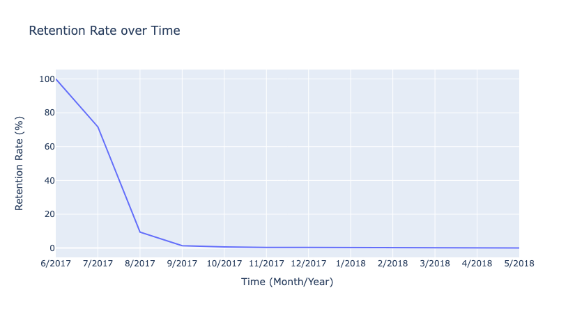
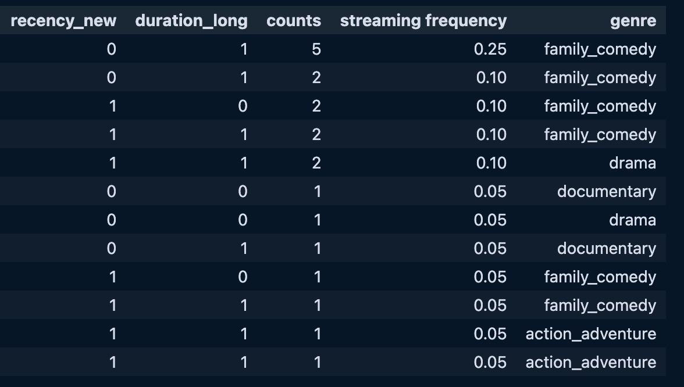

### 1
The assumption that Netflix has a contractual relationship with its customers is reasonable because Netflix operates on a subscription-based model, where users commit to recurring payments for continued access to the platform. In the SVOD industry, services like Netflix typically require users to create an account and agree to monthly or annual billing, which aligns with the definition of a contractual relationship. Although users can cancel their subscription at any time, the ongoing nature of the payment agreement and access to content makes this a contractual relationship. This setup facilitates a more predictable estimation of Customer Lifetime Value (CLV) compared to non-contractual models.

### 2a
(6, 2017) until (5, 2018), Unique users: 20850

### 3a
time  retention_rate
 6/2017      100.000000
 7/2017       71.645330
 8/2017        9.435752
 9/2017        1.422475
10/2017        0.711238
11/2017        0.331911
12/2017        0.331911
 1/2018        0.237079
 2/2018        0.189663
 3/2018        0.047416
 4/2018        0.047416
 5/2018        0.047416

### 3b

### 8a. 
**Attributes and levels (genre mutually exclusive)**

Recency_New: 2 levels (new or not new)

Duration_Long: 2 levels (long or short duration)

Genre: 5 levels
- Comedy
- Drame
- Action_Adventure
- Triller_Crime
- Documentary

$$\text{Total product versions}=5 (genres)×2 (recency)×2 (duration)=20$$

### 8b. 
**Attributes and levels (genre not mutually exclusive)**

Recency_New: 2 levels (new or not new)

Duration_Long: 2 levels (long or short duration)

Genre:
For each genre we can include it in the product or not (2 choices) and we exclude the case where no genre is selected. This grows exponentially in the number of genres.
$$\text{Number of genre combinations} = 2^5 -1 =31 $$

Number of product versions (fully factorial) = $2*2*31 = 124$

#### Discussion:
The non-mutually exclusive case adds significantly more complexity and requires more product versions (124 compared to 20) because we are considering combinations where a product can belong to multiple genres at once. This would make the study harder or infeasible to implement due to the increased number of profiles that need to be tested. Some combinations are not realistic or meaningful (e.g., a movie being both a "Thriller" and a "Comedy" might be rare). The mutually exclusive case is more practical, as it simplifies the study by assuming that a movie can only belong to one genre at a time and it's reasonable to assume that consumers think of genres as mutually exclusive categories. But it may also ignore real-world scenarios where movies can have overlapping genres.

### 8c

The other 9 combinations of attributes are not present in the data.

### 8d
Part-worths:
- recency_new: -0.031579
- duration_long: 0.057895
- genre_family_comedy: 0.111842
- genre_drama: 0.032895
- genre_action_adventure: 0.032895
- genre_thriller_crime: 0.052632
- genre_documentary: 0.036842

#### Conclusion
The slight negative part-worth for recency_new suggests that users in this dataset slightly prefer older content. 
Longer-duration content adds positive utility, indicating that users slightly prefer longer content over shorter content, but the impact is moderate.
The genre genre_family_comedy has the highest positive part-worth, meaning that users strongly prefer family comedy over other genres.
Furthermore the small magnitudes of these part-worths suggest that none of the attributes have a huge impact on user preferences in isolation, but genres stand out as the most influential factor.

### 8e
Relative Importance [%]:
- recency_new: 18.75
- duration_long: 34.375
- genre: 46.875
#### Interpretation
Genre is the most important factor in shaping user preferences, with Family Comedy being the most favored. Users are selective about the type of content they engage with, compared to attributes like recency or duration. Duration holds moderate importance, indicating that users consider the time investment before watching. Recency, being the least important, shows that users are less concerned about how new the content is, and are likely just as content watching older releases. This suggests content characteristics like genre and duration matter more than novelty.

<!---
Practical Implications:

- Content Curation and Recommendations: 
Platforms could focus more on recommending content that aligns with users' preferred genres and durations rather than always pushing the newest content.
- Content Acquisition: 
Platforms may not need to invest as heavily in always acquiring the latest releases, as users are willing to engage with older content, especially if it aligns with their preferred genres.
- Marketing Strategies: 
Marketing campaigns could highlight a combination of genre and duration more than the recency of the content.
-->